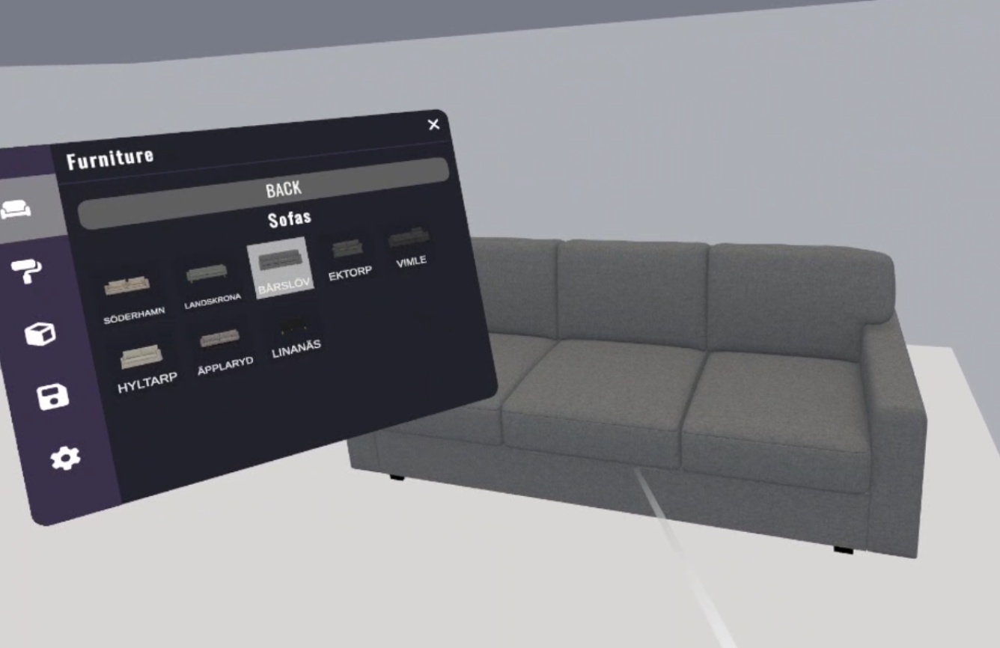
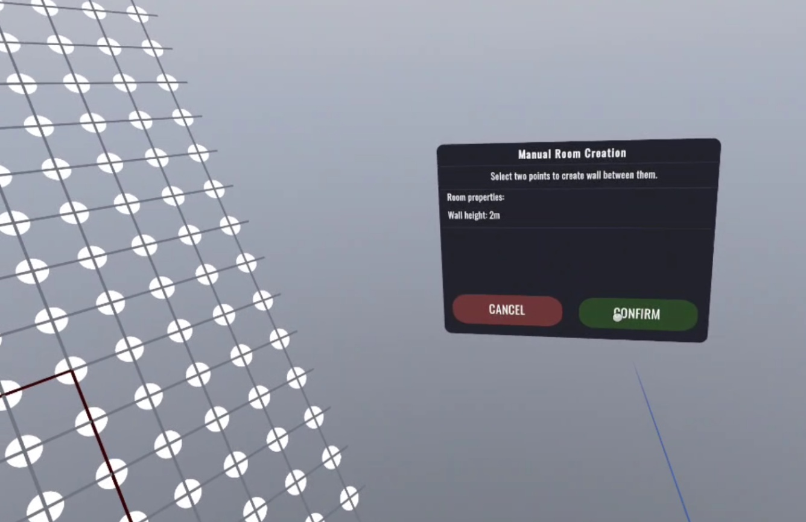
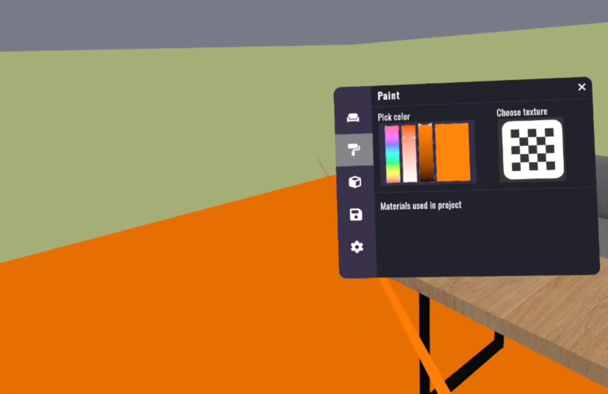
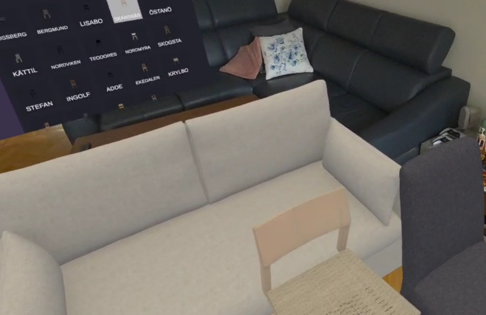

# 🛋️ Room Designer  
AR/VR interior design application for Oculus Quest 3. Built in Unity with Meta XR SDK, allowing users to import room models, place virtual furniture, and experiment with layouts in both mixed and virtual reality.  

## Overview  
**Room Designer** is an interactive **AR/MR interior design app** that helps users visualize furniture arrangements directly in their living space.  
Developed for **Oculus Quest 3**, it combines **mixed reality passthrough** with **full VR room creation**, offering a flexible approach to designing interiors.  

The app allows importing room scans created with Meta Quest tools, placing virtual furniture, and experimenting with layouts through natural interaction. Users can save and reload their arrangements, making it a practical tool for interior design and a showcase of advanced **Unity + XR development skills**.  

## Key Features  
- **Furniture placement** from a catalog of 3D models.  
- **Interactive manipulation** – move, rotate, and remove furniture in real time.  
- **Save & load functionality** for interior layouts.  
- **Paint walls** and customize environments with color selection tools.  
- **Hybrid AR/VR experience** – furnish real rooms in MR or build custom rooms in VR.  

## Technologies Used  
- **Unity Engine (C#)** – core development and scripting.  
- **Meta XR All-in-One SDK** (Core, Interaction, Haptics, Audio, Voice, Platform).  
- **Meta Building Blocks** for Passthrough & Room Model integration.  
- **Meta XR Simulator** for testing without a headset.  
- **Meta MR Utility Kit** for advanced mixed reality features.  

## Skills Demonstrated  
- Development of **cross-platform AR/VR applications** in Unity.  
- Advanced integration of **Meta XR SDKs** for room model import, passthrough, and MR anchoring.  
- **User interaction design** for 3D object manipulation in immersive environments.  
- Implementation of **data persistence** using JSON for saving/loading room layouts.  
- Building **custom UI systems** for VR/MR applications.  
- Experience with **XR simulation & testing pipelines**.  

## Screenshots  
<table>
  <tr>
    <td></td>
    <td></td>
  </tr>
  <tr>
    <td></td>
    <td></td>
  </tr>
</table>

